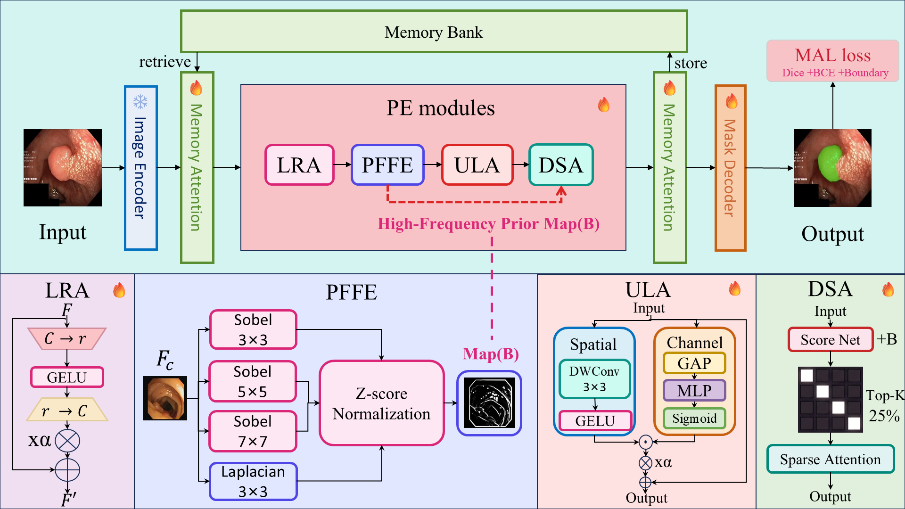

# PE-MedSAM2

> **PE-MedSAM2: Parameter-Efficient Adaptation of MedSAM2 for 2D Medical Image Segmentation**

<p align="center">
  
</p>

<p align="center"><em>
Overall architecture of PE-MedSAM2. The image encoder and mask decoder of MedSAM2 are frozen, while four lightweight PE modules (296K trainable parameters, 0.64% of MedSAM2) are inserted as a post-hoc refinement layer.
</em></p>

---

## 📌 Highlights

- **Parameter-Efficient.** Only **296K trainable parameters** (2.52% of MedSAM2's 11.73M standard fine-tuning budget).
- **Computation-Efficient.** Adds only **+1.79G FLOPs (+11.1%)** and **~2ms latency** over the MedSAM2 baseline.
- **Four Complementary Lightweight Modules.**
  - **LRA** — Low-Rank Adapter for domain transfer
  - **PFFE** — Parameter-Free Feature Enhancement via fixed multi-scale gradient operators
  - **ULA** — Ultra-Lightweight Adapter with depthwise separable decomposition (67% fewer parameters than standard adapters)
  - **DSA** — Dynamic Sparse Attention, selecting top-25% tokens to cut 93.75% of attention computation
- **Consistent gains on 5 benchmarks** across three modalities (polyp, skin lesion, cell nucleus).
- **Best ASD on 4/5 benchmarks** and **best DSC on 4/5 benchmarks**, up to **38.4% ASD reduction** over MedSAM2.

---

## ⚙️ Installation

```bash
# 1. Clone the repo
git clone https://github.com/Yexika/PE-MedSAM2.git
cd PE-MedSAM2

# 2. Create environment (Python 3.10 recommended)
conda create -n pe-medsam2 python=3.10 -y
conda activate pe-medsam2

# 3. Install PyTorch
# Our environment was built with cu121 wheels on a CUDA 12.8 driver
# (forward-compatible). Adjust the index-url to match your CUDA version.
pip install torch==2.4.0 torchvision --index-url https://download.pytorch.org/whl/cu121

# 4. Install other dependencies
pip install -r requirements.txt
```

---

## 🔑 Pre-trained Weights

PE-MedSAM2 is built on top of SAM2 / MedSAM2, so their **pre-trained weights must be obtained from the official sources** before training or testing. We do **not** redistribute these weights in this repository — please download them directly from the original authors to ensure you are using the official releases.

| File | Size | Download from (official) | Place at |
|------|------|--------------------------|----------|
| `sam2.1_hiera_small.pt` | ~180 MB | [SAM2 — facebookresearch/sam2](https://github.com/facebookresearch/sam2#download-checkpoints) | `./checkpoints/sam2.1_hiera_small.pt` |
| `MedSAM2_pretrain.pth`  | ~180 MB | [MedSAM2 — bowang-lab/MedSAM2](https://github.com/bowang-lab/MedSAM2) | `./pretrained_weight/MedSAM2_pretrain.pth` |

After downloading, the repository root should look like:
```
PE-MedSAM2/
├── checkpoints/
│   └── sam2.1_hiera_small.pt         # from facebookresearch/sam2
├── pretrained_weight/
│   └── MedSAM2_pretrain.pth          # from bowang-lab/MedSAM2
└── ...
```

> ⚠️ Please respect the original license terms of SAM2 and MedSAM2 when using their weights.

---

## 📁 Dataset Preparation

Download the five public datasets and organize them under a common root (e.g. `/path/to/datasets/`):

| Dataset       | Source link |
|---------------|-------------|
| CVC-ClinicDB  | [polyp.grand-challenge.org/CVCClinicDB](https://polyp.grand-challenge.org/CVCClinicDB/) |
| Kvasir-SEG    | [datasets.simula.no/kvasir-seg](https://datasets.simula.no/kvasir-seg/) |
| ISIC 2017     | [challenge.isic-archive.com/data/#2017](https://challenge.isic-archive.com/data/#2017) |
| ISIC 2018     | [challenge.isic-archive.com/data/#2018](https://challenge.isic-archive.com/data/#2018) |
| DSB 2018      | [kaggle.com/c/data-science-bowl-2018](https://www.kaggle.com/c/data-science-bowl-2018) |

Expected folder structure:
```
datasets/
├── CVC-ClinicDB/
│   ├── Training/
│   │   ├── images/
│   │   └── masks/
│   └── Test/
│       ├── images/
│       └── masks/
├── Kvasir-SEG/
├── ISIC17/
├── ISIC18/
└── DSB18/
```

All datasets use an **8:1:1 split** with fixed seed `1234` (see `func_2d/dataset_modified.py`). Images are resized to `1024×1024` to match MedSAM2's input resolution.

---

## 🚀 Training

### Train a single dataset
```bash
python train_pe_2d.py \
    -dataset CVC-ClinicDB \
    -data_path /path/to/datasets/CVC-ClinicDB \
    -b 4 \
    -lr 1e-4 \
    -epochs 100 \
    -image_size 1024
```

### Train all five datasets sequentially
```bash
python train_pe_2d.py -dataset all
```

Trained weights are saved to `./weight/PE_MedSAM_<dataset>.pth`.

**Key hyperparameters** (all have sensible defaults in `cfg_pe.py`):
- `-lra_rank 4` — LRA low-rank dimension
- `-ula_compression 16` — ULA compression ratio
- `-dsa_sparsity 0.25` — DSA token selection ratio
- `-pffe_scales 3 5 7` — PFFE Sobel kernel scales
- `-lambda_boundary 0.3` — MAL boundary loss weight

---

## 🧪 Testing

### Test a single dataset
```bash
python test_2d.py -dataset CVC-ClinicDB -data_path /path/to/datasets/CVC-ClinicDB
```

### Test all datasets
```bash
python test_2d.py -dataset all
```

Outputs:
- `Save_2D/<dataset>/per_sample_metrics.csv` — per-sample Dice, IoU, HD95, ASD
- `Save_2D/<dataset>/overlay_*.png` — visualization overlays
- `Save_2D/all_datasets_summary.xlsx` — aggregated metrics across datasets

---

## 🔬 Ablation Studies

Run the full module-level ablation (**E2 w/o LRA**, **E3 w/o PFFE**, **E4 w/o ULA**, **E5 w/o DSA**, **E6 w/o MAL**) on CVC-ClinicDB and ISIC17:

```bash
# Train all ablation configs (skips existing weights automatically)
python run_ablation.py

# Test all ablation configs and generate comparison tables
python test_ablation.py
```

Ablation weights are organized under `weight/ablation/<Exp>/PE_MedSAM_<dataset>.pth`.

Test results include:
- CSV/Excel summaries with per-dataset metrics and deltas relative to the full model
- Module contribution rankings (by Dice drop and ASD increase)
- A LaTeX-ready ablation table for paper use

**Resume a specific ablation run** (e.g. if training was interrupted):
```bash
# Edit EXP_NAME and DATASET at the top of the file, then:
python resume_ablation.py
```

---

## ⚡ Efficiency Profiling

Measure parameters, FLOPs, inference latency, and segmented timing on your hardware:

```bash
python measure_efficiency.py
```

The script produces Tables 8 & 9 from the paper: overall efficiency comparison with MedSAM2, and per-module breakdown of PE-MedSAM2 (LRA / PFFE / ULA / DSA).

---

## 📂 Code Structure

```
PE-MedSAM2/
├── cfg_pe.py                    # Configuration (all hyperparameters + CLI)
├── train_pe_2d.py               # Training entry point
├── test_2d.py                   # Testing entry point
├── run_ablation.py              # Automated ablation training
├── test_ablation.py             # Ablation testing + comparison tables
├── resume_ablation.py           # Resume interrupted ablation runs
├── measure_efficiency.py        # Efficiency profiling
│
├── func_2d/
│   ├── pe_modules.py            # LRA, PFFE, ULA, DSA, MALLoss
│   ├── pe_utils.py              # create_pe_modules, apply_pe_to_features
│   ├── function_pe.py           # Training + validation loop (PE integrated)
│   ├── dataset_modified.py      # Multi-dataset loader
│   ├── filter_utils.py          # Abnormal prediction filtering
│   └── utils.py                 # Network builder, logging
│
├── vis/                         # Paper figures & visualizations
│   └── figoverall_architecture.png
│
├── weight/                      # Trained weights (created during training)
│   └── ablation/                # Ablation experiment weights
└── Save_2D/                     # Test outputs (visualizations + metrics)
```

---

## 📜 Citation

If you find this work useful, please cite:

```bibtex
@article{yuan2026pemedsam2,
  title   = {PE-MedSAM2: Parameter-Efficient Adaptation of MedSAM2 for 2D Medical Image Segmentation},
  author  = {Yuan, Xuejia and Yang, Zongjian and Guo, Yu and Kong, Fanhui and Ma, Jiquan},
  year    = {2026},
  note    = {Manuscript under review at Biomedical Signal Processing and Control}
}
```

> The citation above will be updated with the final journal reference (volume, issue, pages, DOI) once the paper is accepted.

---

## 📬 Contact

For questions or discussions, please open a GitHub issue, or contact:
- Xuejia Yuan
- Jiquan Ma — `majiquan@hlju.edu.cn`

---

## 📄 License

This project is released under the **MIT License** — see [LICENSE](LICENSE) for details.
